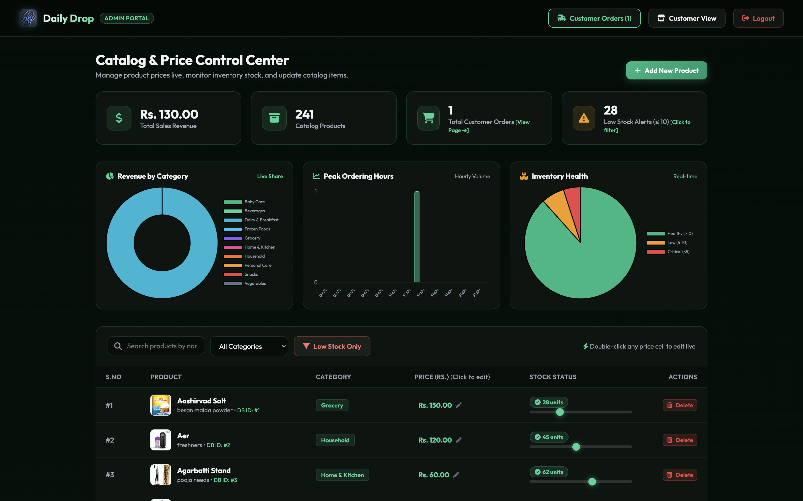

# DailyDrop 🛒

A full-stack e-commerce web application built with Python Flask and SQLite for seamless grocery and daily essentials shopping. DailyDrop features an intuitive customer storefront, persistent shopping cart, secure checkout, and a comprehensive admin management dashboard.

🔗 **[Live Demo](https://daily-drop-c96q-f5su.onrender.com/)**

---

## 🌟 Highlights & Contributions
- **Led a 4-member team** through Agile sprints to build DailyDrop, a full-stack Flask e-commerce app with cart, checkout, and admin dashboard workflows.
- **Designed the relational database schema** for accounts, carts, and orders, implementing role-based session management for customers and administrators.
- **Coordinated task ownership** across frontend and backend modules, resolved cross-module API integration issues, and reviewed teammates’ code to maintain consistent schema and endpoint design.

---

## 📸 Screenshots


*Storefront displaying product catalog grid and category navigation.*


*Glassmorphic administrative control panel with live metric charts.*


*Client-side cart itemization and order placement interface.*

---

## ✨ Features

### 🛍️ Customer Storefront
- **Categorized Catalog**: Browse items across 10 distinct categories (Fruits, Vegetables, Dairy, Snacks, Household, etc.).
- **Smart Shopping Cart**: Real-time client-side cart persistence using `localStorage`.
- **Streamlined Checkout**: Order placement with live pricing validation and instant confirmation.
- **Customer Inquiry Support**: Contact support form backed by SQLite storage.

### 🛡️ Admin Dashboard (`/admin/dashboard`)
- **Sales & Revenue Analytics**: Overview metrics on total revenue, orders, and category distribution.
- **Inventory Management**: Add new products, update pricing, restock items, or remove catalog entries.
- **Order Fulfillment**: Track and update order statuses (`Processing`, `Shipped`, `Delivered`, `Cancelled`).

---

## 🛠️ Tech Stack

- **Backend**: Python, Flask, Jinja2
- **Frontend**: HTML5, Vanilla CSS3 (Glassmorphic UI), JavaScript (ES6+), Chart.js
- **Database**: SQLite3
- **Server / Deployment**: Gunicorn, python-dotenv

---

## 📁 Project Structure

```
Daily-Drop/
├── app.py                  # Main Flask application and REST routes
├── config.py               # Environment configuration
├── database.py             # SQLite schema initialization and CRUD helper methods
├── dashboard.py            # Dashboard metrics helper logic
├── utils.py                # Validation and sanitization utilities
├── requirements.txt        # Python package dependencies
├── run.sh                  # One-click setup and run helper script
├── docs/images/            # Application screenshots and demo assets
├── static/                 # CSS stylesheets, JavaScript files, product images
└── templates/              # Jinja2 HTML templates
```

---

## 🚀 Getting Started

### Prerequisites
- Python 3.8+
- `pip` package manager

### 1. Clone & Setup
```bash
git clone https://github.com/your-username/Daily-Drop.git
cd Daily-Drop
```

### 2. Create Virtual Environment & Install Dependencies
```bash
# Create virtual environment
python3 -m venv venv

# Activate virtual environment
# On macOS/Linux:
source venv/bin/activate
# On Windows:
venv\Scripts\activate

# Install dependencies
pip install -r requirements.txt
```

### 3. Initialize Database & Run
```bash
# Initialize SQLite database schema and sample data
python -c "from database import init_database; init_database()"

# Start the Flask development server
python app.py
```
> Open [http://localhost:5004](http://localhost:5004) in your browser.

*(Optional)* You can also start the app directly using `./run.sh`.

---

## 👥 Authors & Team
- **Team Lead & Full-Stack Developer** – *Architecture, Database Design, API & Session Management, Sprint Coordination*
- Built collaboratively with a 4-member team.
